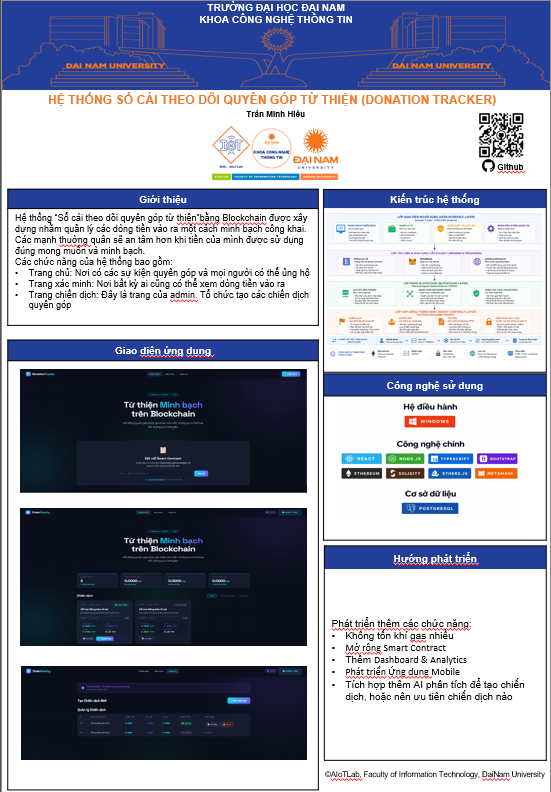

# ❤️ Blockchain Charity Donation System

<table align="center">
  <tr>
    <td align="center">
      
    </td>
    <td align="center">
      
    </td>
  </tr>
</table>

  <b>Decentralized Charity Platform</b> • 
  <b>Transparency</b> • 
  <b>Trust</b>

---

  
  👉 <a href="doc/poster_blockchain.pdf"><b>📄 Xem Poster PDF đầy đủ</b></a>

---

## 🎯 Tổng Quan

Dự án này là một **hệ thống từ thiện phi tập trung (Blockchain Charity System)** giúp:

- Minh bạch dòng tiền 💰  
- Không cần trung gian 🏦  
- Theo dõi giao dịch công khai 🔍  

---

## ✨ Tính Năng Chính

| Tính năng | Mô tả |
|----------|------|
| 💸 Donate | Người dùng gửi ETH vào campaign |
| 📊 Tracking | Theo dõi số tiền real-time |
| 🔐 Smart Contract | Tự động xử lý logic |
| 📜 Transparency | Lưu trên blockchain |
| 👤 Campaign Owner | Tạo chiến dịch |

---

## 🧱 Smart Contract Logic
